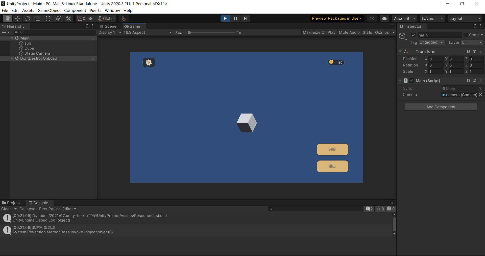
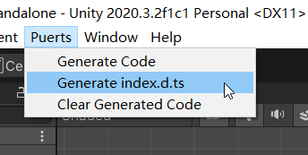
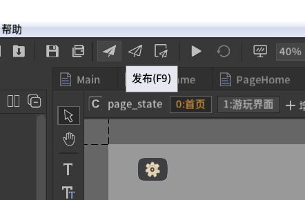

# unity-tskit




**这是一个unity项目脚手架，采用的技术方案如下：**

* Unity 2019/2020 lts
* TypeScript 脚本(puerts) - 1.0.13
* FairlyGUI 界面 - 4.2.0


**提供以下特性：**

* 快速开始一个项目
* 合理的目录划分，适用于高效工作流程
* 提供一套基于标准前端项目规格的ts框架
* 提供背包、存档、叙事、UI管理等内置模块
* 整合脚本对FairyGUI的访问和控制
* 整合source-map支持
* 提供URP渲染管线扩展包


**目录结构：**

* 工程 - 主要面向开发，建议使用git进行版本管理
  * UnityProject 主项目
  * TsProject 脚本项目
  * UIProject 界面项目
* 资源 - 主要面向策划和美术，使用svn或git lfs进行版本管理
  * UI资源
  * 策划文档
  * 创意
  * 故事文案
  * 美术资源
  * 音乐音效


### 如何使用

----------------------------------

#### 0. 准备环境

* Unity 2019/2020 lts
* nodejs 12+ 建议lts  https://nodejs.org
* FairyGUI 编辑器 https://www.fairygui.com/download
* 你喜欢的代码编辑器：如 VSCode / Rider / Visual Studio


#### 1. 建立项目

建立游戏项目目录，将本项目以zip形式下载并解压（不太建议git clone）。

如果使用git单版本管理，建议：全部加入版本库，对资源目录启用**lfs**扩展。

如果你使用git/svn双版本管理，建议：在“工程”目录建立git项目，在资源目录建立svn项目。

>  如果你要使用URP渲染管线，将 **工程/urp-mod/UnityProject** 整个覆盖到 **工程/UnityProject** 下。
>
> 不使用的话urp-mod目录可以删除。


#### 2. 安装puerts依赖

自行去puerts的release页面下载一个v8，例如我们使用1.0.13版本，下载这个：

https://github.com/Tencent/puerts/releases/tag/v1.0.13

压缩包里只有一个Plugins目录，覆盖至本地 **工程\UnityProject\Assets\Plugins** 即可。


用Unity打开 **工程\UnityProject**（如果打开时有版本不符提示一律upgrade、ignore），




#### 3. 生成界面

使用 **FairyGUI 编辑器** 打开 **工程\UIProject\uiproject.fairy**，点击发布。




#### 4. 运行TS项目

在 **工程\TsProject** 目录，打开命令行，运行：

```shell
npm install
```

完成后运行（以后每次写TS项目都要运行这个）

```shell
npm run dev
```

如无意外，你会看到这个，如果没有，根据报错检查前面的步骤：

```shell
🔨 Built in 110ms.
```

现在，大功告成了！

**返回unity运行项目，你就会看到一开始的画面！**


> 备注：ts脚本和ui都会被自动加载。脚本的任何更新会触发一次自动编译，UI则是在“发布”后更新。这时在unity中重启项目即可使用最新的脚本以及UI资源。
>
> 同样的，如果C#代码出现了声明的改动，应当用puerts插件菜单重新生成代码。建议将自己添加的所有C#类写在game这个namespace下，这样他们会被自动导出到ts项目。


>  备注2：不要去更新esbuild的版本。**0.8.54**是最后一个可用版本。新版(<=0.12.15)在require的处理上与puerts不兼容。


#### 5. 打包

停止`npm run dev`后运行：

```
npm run build
```

这样可以避免将map文件打包进去。

剩下按照unity正常打包流程走即可。

